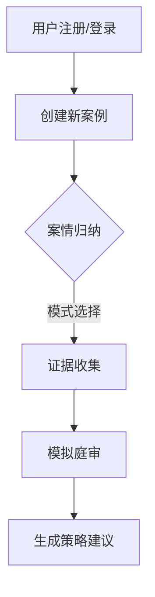

# MoE-Law-Agent
## （一）研究背景

- 近些年，AI行业迅速发展，各类基于AI的工具层出不穷
- 当前法律相关AI工具存在三大痛点：
  1. 基于单智能体架构，易产生模型幻觉问题
  2. 使用难度大，功能单一
  3. 现有产品多聚焦法考知识问答，缺乏庭审流程结合

## （二）选题目的

- 构建基于混合专家（MoE）模型的法律服务APP，实现两大核心功能：
  - ✅ 法律知识学习与自测
  - ✅ 案例分析与专业建议生成
- 通过数据积累实现智能进化：
  - 数据量↑ → 建议精准度↑

## （三）研究意义

### 跨学科价值
- **法学+AI融合创新**：结合知识图谱的MoE模型突破传统AI局限
- **方法论创新**：多智能体系统整合逻辑推理、伦理规范与司法规律

### 现实意义
1. **技术实践维度**  
   - 全周期开发经验：系统规划→设计→编码→发布
   - 深入掌握AI系统开发全流程

2. **知识提升维度**  
   - 法律知识体系构建：涵盖刑法/民法等专业领域
   - 法治社会参与实践

3. **社会应用维度**  
   - 预防法律纠纷升级
   - 降低非理性决策风险

---

# 二．功能模块

## 核心功能模块

### 1. 用户管理
- 基础功能：注册/登录/案情存储

### 2. 证据归纳
- 多模态处理能力：
  - 支持图像/录音/文字识别
  - 自动构建证据链

### 3. 案情归纳
- **双模式设计**：
  - 新手引导（多轮对话）
  - 专业辅助（扩写润色）
- 交互方式：语音/文字双通道

### 4. 模拟庭审
- **多智能体协作架构**：
  - 主法官：DeepSeek-R1（流程控制）
  - 角色库：律师/合议庭模拟（Claude长文本处理）
- 输出成果：庭审报告+漏洞诊断

### 5. 策略建议
- 上下文感知分析
- 风险预警系统

---

## 系统操作流程

---
拓展功能
- 法考培训模块：支持用户扮演庭审中的特定角色（如律师、法官），通过实战演练提升法律实务能力。  

---

 关键技术创新  
- 多模态 AI 融合：整合图像识别、语音处理、文本分析技术，实现全类型证据处理。  
- 动态角色分配：根据不同 AI 模型的优势（如 Claude 的长文本处理、DeepSeek 的逻辑推理）优化庭审模拟效果。  

